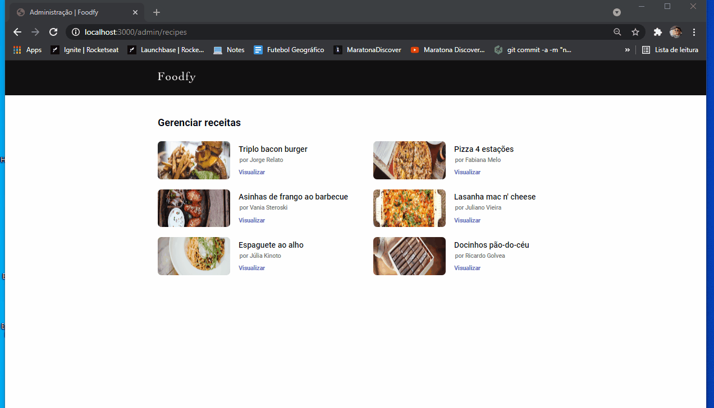

# Foodfy Project

Foodfy is an application designed by Rocketseat for the Launchbase Bootcamp. This app allows the user to register, update and delete recipes.

:brazil: Foodfy é uma aplicação projetada pela Rocketseat para o bootcamp Launchbase. Essa aplicação permite ao usuário cadastrar, atualizar e deletar receitas.

## Client side 

- Home page 
- About page
- Recipes page

### Resposivity: client side

 
 

## Administrative area of the app

- List of all recipes registered in the database
- Create recipe page
- Edit recipe page (Delete or Update)

For the delete part, i made a modal so the user can confirm that it really wants to delete the recipe.

## Responsivity: administrative area

 

Developed by Caíque Rodrigues - Web Development Student :tada: